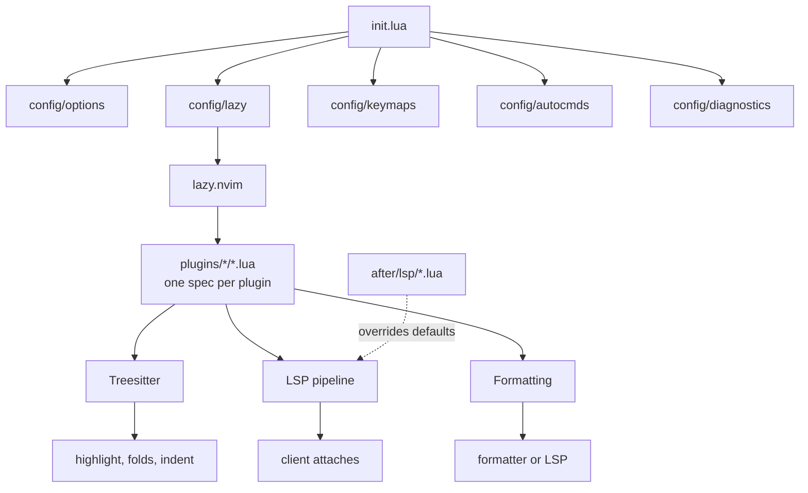
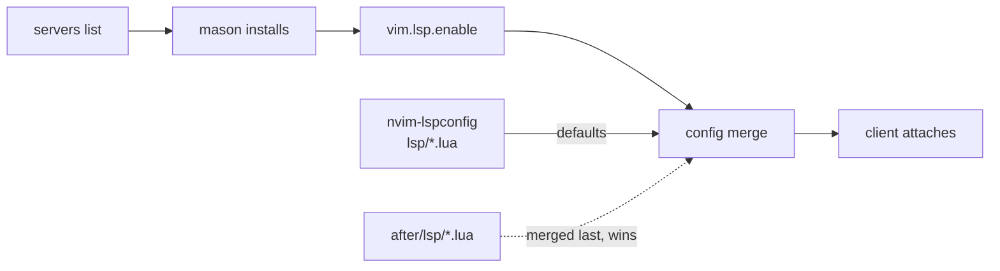
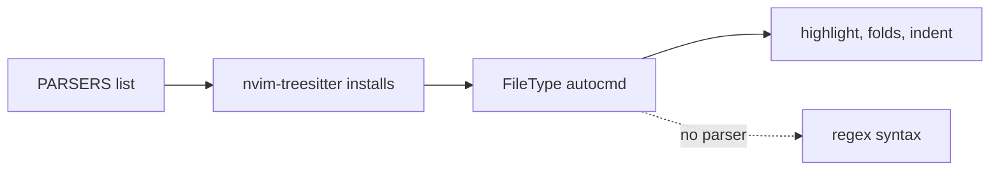

# Architecture

This page shows how the config fits together: what runs at startup, how plugins load, and how the LSP, Treesitter and formatting pipelines work. For the details of a single option or plugin, read the header comment of the file it lives in.

## Overview



The LSP pipeline, Treesitter and Formatting nodes each have their own section below.

## Directory layout

```text
~/.config/nvim/
├── init.lua             entry point: loads the lua/config/ modules in order
├── lua/
│   ├── config/          editor setup that doesn't depend on any plugin
│   └── plugins/
│       └── <category>/  one file per plugin, grouped by what the plugin does
├── after/               loaded last on the runtime path, so its files override plugin defaults
│   └── lsp/             per-server overrides, one file per server
├── stylua.toml          Lua formatting rules
└── lazy-lock.json       pinned plugin commits
```

## Startup order

[`init.lua`](../init.lua) only calls `require` on the modules in `lua/config/`, in a fixed order:

1. [`options`](../lua/config/options.lua) sets the leader keys and editor options. It runs first because lazy.nvim reads the leader keys when it registers plugin keymaps.
2. [`lazy`](../lua/config/lazy.lua) bootstraps lazy.nvim and loads every plugin spec.
3. [`keymaps`](../lua/config/keymaps.lua) adds mappings that don't depend on a plugin.
4. [`autocmds`](../lua/config/autocmds.lua) adds core autocommands.
5. [`diagnostics`](../lua/config/diagnostics.lua) sets how diagnostics are shown.

Nothing in `lua/config/` depends on a plugin, so the editor still works if a plugin fails to load. One module there isn't in this list: [`tools`](../lua/config/tools.lua) is plain data, the servers, formatters and linters to install, and the LSP plugin specs `require` it.

## How plugins load

lazy.nvim doesn't look inside subfolders of `lua/plugins/`. Instead, `lua/config/lazy.lua` imports each category folder with its own line:

```lua
{ import = "plugins.<category>" },
```

Every folder has an `init.lua` that returns an empty spec. It describes what belongs in the category and makes sure the import still works if the folder has no other files. Each other file in the folder returns the spec for one plugin.

Plugins load at startup unless the spec gives lazy.nvim a trigger to wait for:

- `event`: an autocommand event, such as `InsertEnter`
- `ft`: a filetype
- `keys`: the first press of one of the spec's keymaps
- `cmd`: the first use of one of the plugin's commands

Plugins track their latest commit, not their release tags (`version = false`). `lazy-lock.json` records which commit is installed.

## LSP pipeline

Language servers go through four stages, from a name in a list to a client attached to the buffer:



1. **List.** [`config/tools.lua`](../lua/config/tools.lua) names every server, formatter and linter the config needs. [mason-tool-installer](../lua/plugins/lsp/mason-tool-installer.lua) installs missing entries in the background, just after startup.
2. **Install.** [mason.nvim](../lua/plugins/lsp/mason.lua) downloads each package into Neovim's data directory and adds its binaries to `$PATH`.
3. **Enable.** [`lspconfig.lua`](../lua/plugins/lsp/lspconfig.lua) calls `vim.lsp.enable()` for each entry in the servers list, at startup, so a file opened with `nvim file` gets its server. Servers installed from `:Mason` but missing from the list are not enabled.
4. **Configure.** Neovim builds each server's config by merging every `lsp/<server>.lua` on the runtime path. nvim-lspconfig ships the defaults. Files in [`after/lsp/`](../after/lsp) merge last, so their settings win.

Once a server attaches, Neovim's default LSP keymaps apply (`:help lsp-defaults`).

## Treesitter

Treesitter parses each buffer into a syntax tree, which Neovim uses for highlighting, folds and indent that follow the code's structure:



1. **List.** `PARSERS` in [`nvim-treesitter.lua`](../lua/plugins/treesitter/nvim-treesitter.lua) names every parser the config needs. Entries are language names, not filetypes. Neovim already bundles parsers for a few languages.
2. **Install.** Missing parsers compile in the background just after startup, which needs the tree-sitter CLI and a C compiler. `build = ":TSUpdate"` recompiles them when the plugin updates.
3. **Start.** On `FileType`, the config calls `vim.treesitter.start()` and sets `foldexpr` and `indentexpr` to their treesitter versions. Buffers whose language has no parser keep the regex syntax.

The other plugins in `lua/plugins/treesitter/` build on the same syntax tree.

## Formatting

[conform.nvim](../lua/plugins/coding/conform.lua) formats the buffer. It runs the formatter listed for the buffer's filetype. When none is listed, it asks the language server instead. A formatter can be limited to projects that configure it: prettier runs only where a Prettier config exists, and the language server formats everywhere else.

Some tools are both a formatter and a language server. Put each such tool in one of the two lists in [`config/tools.lua`](../lua/config/tools.lua):

- If you only want it as a formatter, put it in `formatters`. It is installed but never started as a server.
- If its server does other useful work, such as linting, put it in `servers` and turn off its formatting in `after/lsp/<server>.lua`, as `after/lsp/ruff.lua` does.
